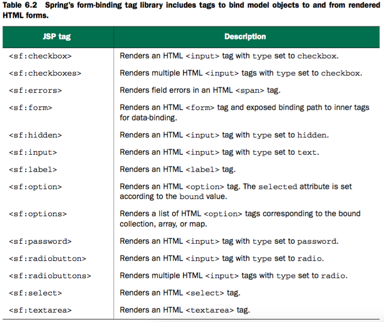

### ViewResolver
Spring MVC 定义了一个名为 ViewResolver 的接口, 它大致如下所示:
```java
public interface ViewResolver {
    View resolveViewName(String viewName, Locale locale) throws Exception;
}
```
当给 resolveViewName() 方法传入一个视图名称和 Locale 对象时, 它会返回一个 View 实例。 View 是另外一个接口, 如下所示:
```java
public interface View {
    String getContentType();
    void render(Map<String, ?> model, HttpServletRequest req, HttpServletResponse resp) throws Exception;
}
```
View 接口的任务就是接受模型以及Servlet的request和response对象,并将输出结果渲染到response中。

- Spring提供了多个内置的实现

  视图解析器                     |  描述
--------------------------------|----------
BeanNameViewResolver            | 将视图解析为Spring应用上下文中的Bean,其中Bean的ID与视图的名字相同
ContentNegotiatingViewResolver  | 通过考虑客户端需要的内容类型来解析视图,委托给另一个能够产生对应内容类型的视图解析器
FreeMarkerViewResolver          | 将试图解析为FreeMarker模板
InternalResourceViewResolver    | 将视图解析为Web应用的内部资源(一般为JSP)
JasperReportsViewResolver       | 将试图解析为JasperReports定义
ResourceBundleViewResolver      | 将试图解析为资源bundle(一般为属性文件)
TilesViewResolver               | 将试图解析为Apache Tile定义,其中tile ID与视图名称相同。注意有两个不同的TilesViewResolver实现,分别对应Tiles2和Tiles3
UrlBasedViewResolver            | 直接根据视图的名称解析视图,视图的名称会匹配一个物理视图的定义
VelocityLayoutViewResolver      | 将视图解析为Velocity布局,从不同的Velocity模板中组合页面
VelocityViewResolver            | 将视图解析为Velocity模板
XmlViewResolver                 | 将试图解析为特定XML文件中的Bean定义,类似于BeanNameViewResolver
XsltViewResolver                | 将试图解析为XSLT转换后的结果

### 创建JSP视图

Spring提供了两种支持JSP视图的方式:
> - InternalResourceViewResolver会将试图名称解析为JSP文件。另外,如果在理的JSP页面中使用了JSP标签库(JSTL)的话,
>   InternalResourceViewResolver能够将视图名解析为JstlView形式的JSP文件,从而将JSTL本地化和资源bundle变量暴露给JSTL的格式化(formatting)和信息(message)标签。
> - Spring提供了两个JSP标签库,一个用于表单到模型的绑定,另一个提供了通用的工具类特性。

1). 配置适用于JSP的视图解析器
```text
InternalResourceViewResolver 最终会将逻辑视图解析为 InternalResourceView 实例,这个实例会引用JSP文件。
```
```java
    @Bean
    public ViewResolver viewResolver() {
        IntenalResourceViewResolver resolver = new InternalResourceViewResolver();
        resolver.setPrefix("/WEB-INF/views/");
        resolver.setSuffix(".jsp");
        return resolver;
    }
```
或
```xml
<bean id="viewResolver"
    class="org.springframework.web.servlet.view.InternalResourceViewResolver"
    p:prefix="/WEB-INF/views/"
    p:suffix=".jsp"
    />
```
InternalResourceViewResolver配置就绪之后,它就会将逻辑视图解析为JSP文件,如下所示:
> home 将会解析为 "/WEB-INF/views/home.jsp"

2). 解析JSTL视图
```text
如果JSP使用JSTL标签来处理格式化和信息的话,那么我们希望InternalResourceViewResolver将试图解析为JstlView;
JSTL 的格式化标签需要一个 Locale 对象,以便于恰当的格式化地域相关的值,如日期和货币;
通过解析JstlView,JSTL能够获得Locale对象以及Spring中的配置的信息资源。
```
```java
    @Bean
    public ViewResolver viewResolver() {
        IntenalResourceViewResolver resolver = new InternalResourceViewResolver();
        resolver.setPrefix("/WEB-INF/views/");
        resolver.setSuffix(".jsp");
        resolver.setViewClass(org.springframework.web.servlet.view.JstlView.class);
        return resolver;
    }
```
或
```xml
<bean id="viewResolver"
    class="org.springframework.web.servlet.view.InternalResourceViewResolver"
    p:prefix="/WEB-INF/views/"
    p:suffix=".jsp"
    p:viewClass="org.springframework.web.servlet.view.JstlView"
    />
```
#### 将表单绑定到模型上
```text
Spring的表单绑定JSP标签库包含了14个标签,它会绑定模型中的一个对象,能够根据模型中对象的属性填充值;
标签库中还包含了一个为用户展现错误的标签,它会将错误信息渲染到最终的HTML之中。
```



#### 表单数据校验和错误处理

```jsp
<!-- 为了使用表单绑定库,需要在JSP页面中对其进行声明 -->
<%@ taglib uri="http://www.springframework.org/tags/form" prefix="sf" %>
```
```jsp
<!-- 绑定spitter对象到表单 -->
<sf:form method="POST" commandName="spitter" action="register">
	<!-- sf:errors 标签的path属性值设置为 “*” ,这是一个通配符选择器表示展示所有属性的所有错误 -->
    <sf:errors path="*" element="div" cssClass="error"/>
    <!-- 验证失败时为标签添加 class 属性值   -->
    <sf:label path="firstName" cssErrorClass="error">
    	First Name:
    	<!-- 绑定spitter对象的firstName属性 -->
        <sf:input path="firstName"/>
    </sf:label>
    <!-- firstName 参数验证失败是展示错误信息 -->
    <sf:errors path="firstName" cssClass="error"/>
    <br/>
    <sf:label path="lastName" cssErrorClass="error">
    	Last Name:
        <sf:input path="lastName"/>
    </sf:label>
    <input type="submit" value="Register"/>
</sf:form>
```
```java
@Controller
public class SpitterController {

    @RequestMapping(value = "register", method = GET)
    public String showRegistrationForm(Model model) {
        Spitter defaultSpitter = new Spitter();
        // 设置表单的默认值
        defaultSpitter.setUsername("Guest");
        // 在模型中必须有一个key为spitter的对象,否则的话,表单不能正常渲染(会出现JSP错误 java.lang.IllegalStateException: Neither BindingResult nor plain target object for bean name 'spitter' available as request attribute)
        model.addAttribute(defaultSpitter);
        return "registerForm";
    }

    @RequestMapping(value = "register", method = POST)
    public String showRegistrationForm(@Valid Spitter spitter, Errors errors) {
        // 校验错误处理
        if (errors.hasErrors()) {
            return "registerForm";
        }
        // 保存 Spitter
        // ...
        return "redirect:register";
    }
}

public class Spitter {
    // 在 bean 中添加校验规则
    @NotNull
    // 在 message 属性值中直接指定校验错误时的返回信息
    @Size(min = 5, max = 12, message = "First Name 值的长度在 5 到 12 之间")
    private String firstName;

    @NotNull
    // message 属性值从资源文件 ValidationMessages.properties 中获取, 错误信息的键包含在 "{" 和 "}" 之间
    @Size(min = 5, max = 12, message = "{spitter.lastName}")
    private String lastName;
}
```
```properties
# ValidationMessages.properties
# “{” 和 “}” 之间的占位符对应的值从注解中获取; 如: {min} 和 {max} 的值会引用 @Size 注解上所设置的 min 和 max 属性
spitter.lastName=size must be between {min} and {max}
```
```properties
# ValidationMessages_zh_CN.properties
# 国际化错误信息 (中文 zh_CH); 中文使用 Unicode 字符描述
spitter.lastName=\u4E2A\u6570\u5FC5\u987B\u5728{min}\u548C{max}\u4E4B\u95F4
```

#### Sring通用的标签库

  JSP 标签         |  描述
-------------------|-----
<s:bind>           | 将绑定属性的状态导出到一个名为status的页面作用域属性中，与<s:path>组合使用获取绑定属性的值
<s:escapeBody>     | 将标签体中的内容进行HTML和/或JavaScript转义
<s:hasBindErrors>  | 根据指定模型对象（在请求属性中）是否有绑定错误，有条件的渲染内容
<s:htmlEscape>     | 为当前页面设置默认的HTML转义值		
<s:message>        | 根据给定的编码获取信息，然后要么进行渲染（默认行为），要么将其值设置为页面作用域，请求作用域、会话作用域或应用作用域的变量（通过使用var和scope属性实现）
<s:nestedPath>     | 设置嵌入式的path，用于<s:bind>之中
<s:theme>          | 根据给定的编码获取主题信息，然后要么进行渲染（默认行为），要么将其设置为页面作用域、请求作用域、会话作用域或应用作用域的变量（通过使用var和scope属性实现）
<s:transform>      | 使用命令对象的属性编辑器转换命令对象中不包含的属性
<s:url>            | 创建相对于上下文URL，支持URL模板变量以及HTML/XML/JavaScript转义，可以渲染URL（默认行为），也可以将其设置为页面作用域、请求作用域、会话作用域或应用作用域的变量（通过使用var和scope属性实现）
<s:eval>           | 计算符合Spring表达式语言（SpEL）语法的摸个表达式的值，然后要么进行渲染（默认行为），要么将其设置为页面作用域、请求作用域、会话作用域或应用作用域的变量（通过使用var和scope属性实现）


