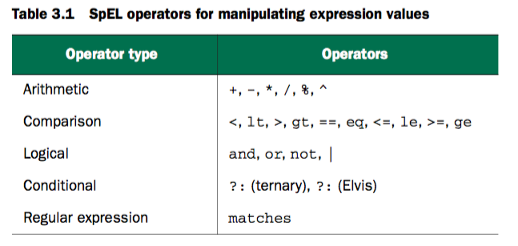

### @Profile 配置切换
- @Profile 注解基于 @Conditional 和 Condition 实现
- Source Code
```java
    @Retention(RetentionPolicy.RUNTIME)
    @Target({ElementType.TYPE, ElementType.METHOD})
    @Documented
    @Conditional(ProfileCondition.class)
    public @interface Profile {
        String[] value();
    }

    class ProfileCondition implements Condition {
        @Override
        public boolean matches(ConditionContext context, AnnotatedTypeMetadata metadata) {
            if (context.getEnvironment() != null) {
                MultiValueMap<String, Object> attrs = metadata.getAllAnnotationAttributes(Profile.class.getName());
                if (attrs != null) {
                    for (Object value : attrs.get("value")) {
                        if (context.getEnvironment().acceptsProfiles(((String[]) value))) {
                            return true;
                        }
                    }
                    return false;
                }
            }
            return true;
        }
    }
```

### Scope bean作用域
Spring 定义了多种作用域,可已基于这些作用域创建 bean,包括:
- 单例(Singleton): 在整个应用中,只创建bean的一个实例
- 原型(Prototype): 每次注入或者通过Spring应用上下文获取的时候,都会创建一个新的bean实例
- 会话(Session): 在Web应用中,为每个会话创建一个bean实例
- 请求(Request): 在Web应用中,为每个请求创建一个bean实例

```java
    @Scope(value = WebApplicationContext.SCOPE_SESSION, proxyMode = ScopedProxyMode.INTERFACES)
    // @scope 同时还有一个 proxyMode 属性, 他被设置成 ScopedProxyMode.INTERFACES。这个属性解决了将会话或请求作用域的 bean 注入到单例 bean 中所遇到的问题。
```


### Placeholder 属性占位符
声明使用 PropertySourcesPlaceholderConfigurer 解析属性占位符 ${...}

- JavaConfig
```java
    @Configuration
    @PropertySource({"classpath:Externals1.properties", "classpath:Externals2.properties"})
    public class EnvironmentAndPlaceholderConfig {
        @Bean
        public static PropertySourcesPlaceholderConfigurer placeholderConfigurer() {
            return new PropertySourcesPlaceholderConfigurer();
        }
    }
```

- XmlConfig
```xml
    <context:property-placeholder location="Externals1.properties" order="1"/>
    <context:property-placeholder location="Externals2.properties" order="2"/>
```

### SpEL spring表达式语言
SpEL 表达式放置于 #{...} 拥有很多特性,包括:
- 使用bean的id来引用bean;
- 调用方法和访问对象的属性;
- 对值进行算术,关系和逻辑运算;
- 正则表达式匹配;
- 集合操作;
```java
    // T()表达式会将java.lang.System视为Java中对应的类型,因此可以调用其static修饰的currentTimeMillis()方法(或属性)
    #{T(System).currentTimeMillis()}
    // 通过systemProperties对象引用系统属性
    #{systemProperties['disc.title']}
    // 得到id为sgtPeppers的bean
    #{sgtPeppers}
    // 得到id为sgtPeppers的bean的artist属性
    #{sgtPeppers.artist}
    // 调用id为sgtPeppers的bean的getArtist()方法
    #{sgtPeppers.getArtist()}

    // 表示字面值
    #{3.14159}
    #{9.87E4} //科学计数法
    #{'Hello'}
    #{false}

    // (.? 运算符) 如果 artistSelector.selectArtist() 的返回值不为 null 则调用 toUpperCase() 方法, 否则直接返回 null 值
    #{artistSelector.selectArtist()?.toUpperCase()}
```
```java
    public BlankDisk(
        @Value("#{systemProperties['disc.title']}") String title,
        @Value("#{systemProperties['disc.artist']}") String artist) {
        this.title = title;
        this.artist = artist;
    }
```
```xml
    <bean id="sgtPeppers" class="myPackage.BlankDisk"
            c:_title="#{systemProperties['disc.title']}"
            c:_artist="#{#{systemProperties['disc.artist']}"/>
```


