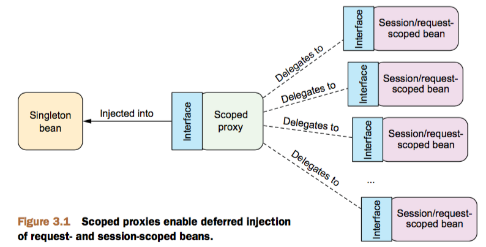

### @Profile
- @Profile 注解基于 @Conditional 和 Condition 实现
- Source Code
```java
    @Retention(RetentionPolicy.RUNTIME)
    @Target({ElementType.TYPE, ElementType.METHOD})
    @Documented
    @Conditional(ProfileCondition.class)
    public @interface Profile {
        String[] value();
    }

    class ProfileCondition implements Condition {
        @Override
        public boolean matches(ConditionContext context, AnnotatedTypeMetadata metadata) {
            if (context.getEnvironment() != null) {
                MultiValueMap<String, Object> attrs = metadata.getAllAnnotationAttributes(Profile.class.getName());
                if (attrs != null) {
                    for (Object value : attrs.get("value")) {
                        if (context.getEnvironment().acceptsProfiles(((String[]) value))) {
                            return true;
                        }
                    }
                    return false;
                }
            }
            return true;
        }
    }
```

### Scope
Spring 定义了多种作用域,可已基于这些作用域创建 bean,包括:
- 单例(Singleton): 在整个应用中,只创建bean的一个实例
- 原型(Prototype): 每次注入或者通过Spring应用上下文获取的时候,都会创建一个新的bean实例
- 会话(Session): 在Web应用中,为每个会话创建一个bean实例
- 请求(Request): 在Web应用中,为每个请求创建一个bean实例

```java
    @Scope(value = WebApplicationContext.SCOPE_SESSION, proxyMode = ScopedProxyMode.INTERFACES)
    // @scope 同时还有一个 proxyMode 属性, 他被设置成 ScopedProxyMode.INTERFACES。这个属性解决了将会话或请求作用域的 bean 注入到单例 bean 中所遇到的问题。
```


### Placeholder
声明使用 PropertySourcesPlaceholderConfigurer ${...} 解析占位符

- JavaConfig
```java
    @Bean
    public static PropertySourcesPlaceholderConfigurer placeholderConfigurer() {
        return new PropertySourcesPlaceholderConfigurer();
    }
```

- XmlConfig
```xml
    <context:property-placeholder location="Externals1.properties" order="1"/>
    <context:property-placeholder location="Externals2.properties" order="2"/>
```
